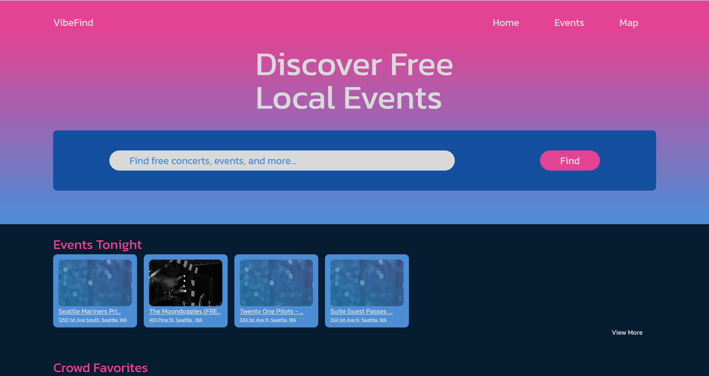
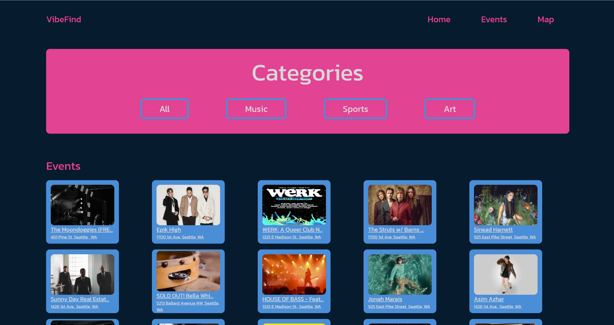
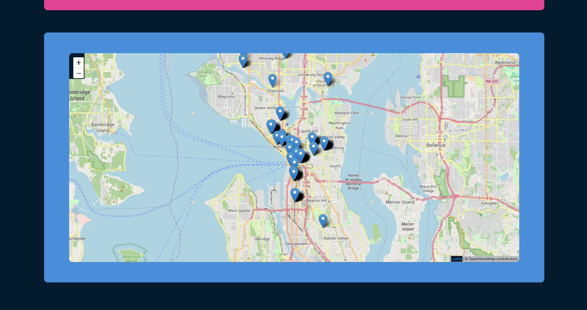

# Free Event App

A Django-based web application designed to help users discover free local events in their area. This tool allows users to search for specific events, view details, and explore an interactive map with event locations.





## Features

- **Event Listings:** Display a list of local events, including concerts, sports, arts, and family-friendly events.
- **Category Filters:** Filter events by category, such as Music, Sports, and Art.
- **Interactive Map:** View event locations on an interactive map with clickable markers that display event details.
- **Search Functionality:** Search for events using keywords and view matching results.
- **Detailed Event View:** See detailed information about each event, including title, date, location, description, and a link to the event page.
- **Responsive Design:** The application is fully responsive, providing an optimal viewing experience across all devices.

## APIs Used

This project uses the following API to fetch data:

- **[Ticketmaster API](https://developer.ticketmaster.com/):** Provides event data, including location, date, and other event details.

Make sure to obtain API keys and set them up in your environment variables as part of the installation or deployment process.

## Installation

### Prerequisites

Ensure you have Python 3.x installed on your system. You can download it from [python.org](https://www.python.org/).

### Required Python Packages

This project requires the following Python packages:
- `Django`
- `requests`

You can install them using `pip`:

```bash
pip install django requests
```

### Setting Up the Project

1. Clone this repository to your local machine:

   ```bash
   git clone https://github.com/ry-schwartz/free_event_app.git
   cd free_event_app
   ```
2. Ensure all dependencies are installed (as mentioned above).

3. Run database migrations:

    ```bash
   python manage.py migrate
   ```

4. Collect static files:

    ```bash
   python manage.py collectstatic
   ```

5. Set up environment variables for the API key(s):

    ```bash
   export TICKETMASTER_API_KEY='your-ticketmaster-api-key'
   ```

### Usage

To run the application locally, navigate to the project directory and execute the following command:

   ```bash
   python manage.py runserver
   ```

1. Open your web browser and go to `http://127.0.0.1:8000/`.
2. Use the search bar on the home page to find events.
3. Click on an event to view detailed information
4. Click on the Event navigation to view and filter all events
5. Click on the Map navigation to view all events on an interactive map

### Deployment on Heroku

This project is configured to be deployed on Heroku. Follow these steps:

1. Ensure you have the Heroku CLI installed.

2. Log in to your Heroku account:

    ```bash
   heroku login
   ```

3. Create a new Heroku application:

    ```bash
   heroku create free_event_app
   ```

4. Set up the environment variables required for the project:

    ```bash
   heroku config:set SECRET_KEY='your-secret-key'
   heroku config:set DEBUG=0
   heroku config:set TICKETMASTER_API_KEY='your-ticketmaster-api-key'
   ```

5. Push the code to Heroku:

    ```bash
   git push heroku main
   ```

6. Run the database migrations on Heroku:

    ```bash
   heroku run python manage.py migrate
   ```

7. Open the application in your web browser:

    ```bash
   heroku open
   ```

### Troubleshooting

- If the application fails to fetch data, ensure you have an active internet connection.
- If no data is displayed for an event, verify that the event exists and that its API data is available.
- On Heroku, make sure that all environment variables are correctly set.

### Contributing

Contributions are welcome! Please fork the repository and submit a pull request if you wish to improve the application or fix bugs.